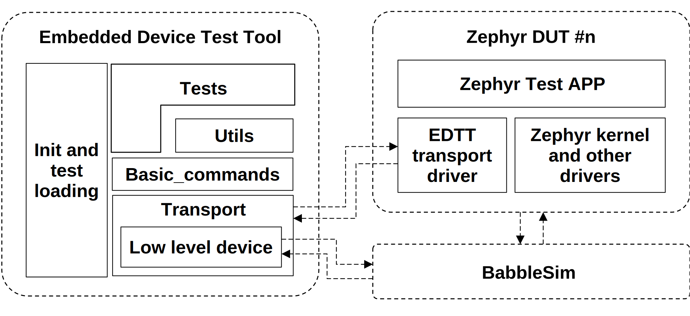

# EDTT framework and BabbleSim
(With focus on Zephyr BLE testing on a PC)

## Introduction

The purpose of this document is to provide a basic understanding of the EDTT Framework for developers writing Tests for the Framework. It is assumed that the reader is familiar and knows how to use [BabbleSim](http://babblesim.github.io/), and how to run  [Zephyr](https://docs.zephyrproject.org/) code on a standard Linux PC thru the [nrf52_bsim board](https://docs.zephyrproject.org/latest/boards/posix/nrf52_bsim/doc/index.html).
The EDTT Framework is made for testing BLE functionality in the Zephyr Bluetooth implementation.
Here, the EDTT Framework is using the BabbleSim radio simulation, together with simulated Zephyr Bluetooth stacks, where the Zephyr code is running on a standard Linux PC rather than a dedicated embedded system.
This setup provides the developer with a powerful environment, where tracing and debugging becomes a lot easier compared to an embedded system.
Tests, and the EDTT framework are written in Python, and their execution is decoupled from the simulated Zephyr Bluetooth stacks, in the sense that tests are running in their own process communicating with the simulated Zephyr Bluetooth stack through Named Pipes.
Each test relies on a specific Zephyr application running in the simulated devices. This application can be a standalone application reacting to stimuli received “over the air”, a dedicated application responding to specific commands sent from the EDTT or a combination of the two.
One of these test applications responds to standard HCI commands sent from the test and returns standard Events to the test.

## Framework
The Framework consists of a test execution part and a set of simulated Zephyr Bluetooth stacks as shown in the Figure 1 (EDTT framework TODO) below.



The two execution environments are connected thru Named Pipes. Since Bluetooth is all about communicating entities, a test needs access to more than a single DUT.

The EDTT transport ensures that the simulation is halted when needed while the EDTT is processing. That is, the result of the simulation does not depend on the python execution speed.
In principle any number of DUTs can be supported, but in reality only two DUTs are used for testing. The setup is illustrated in the next figure .


In addition to the DUTs, the EDTT BabbleSim transport also has a low level device that connects directly to BabbleSim. This device can be used to send raw BLE packets without going through a Zephyr device (with the limitations that brings).

---
### The transport

The transport is conceptually a two-way FIFO for each DUT.

Commands are atomic transactions that maps to calls on the DUT side. Cannot be interleaved (for simplicity).

Utils are a set of commands shared between tests.

Transport EDTT side API:

* open(device_id), connect(device_id), close(device_id)
* send(device_id, message),
* recv(device_id, count, timeout)
* wait(time), get_time()

Transport DUT side API:

* start(), stop()
* read(u8_t *pbuffer, size_t count, int flags)
* write(u8_t *pbuffer, size_t count, int flags)

---

In BabbleSim, EDTT is just another program being executed in parallel with the programs running the individual DUTs. Each DUT is configured to run one of the EDTT Test APPs, implementing the Command executor.

The EDTT transport must know how many DUTs it needs to connect to and the identity of each DUT. This information is passed as run-time parameters to the EDTT. A typical execution of BabbleSim and two DUTs could look as shown here:

```
./bs_2G4_phy_v1 –s=Test –D=3 –sim_length=5e6 -dump_imm &

./bs_nrf52_bsim_hci_test_app_bsim –s=Test –d=1 –v=3 &

./bs_nrf52_bsim_hci_test_app_bsim –s=Test –d=2 –v=3

./bs_edttool –s=Test –d=0 –t bsim -T hci_verification –C HCI/CIN/BV-04-C -l -D=2 -devs 1 2 –RxWait=2.5e3 &
```


The radio simulation is configured with the simulation name “Test” (-s=Test). It is told to host three devices (-D=3). The simulation length is set to 5 seconds (-sim_length=5e6). And it is told to disable cached writes for the dump files (-dump_imm).

The EDTT Test APP is started twice to simulate the two DUTs. The EDTT Test APP is handed the name of the simulation “Test” (-s=Test) and its own device identifier (-d=1 or –d=2).

Last, the EDTT itself is started. It is handed the name of the simulation “Test” (-s=Test), its own device identifier (-d=0), the number of DUTs to service (-D=2) and the device identifiers for the two DUTs (-dev 1 2).

To run with the low level device enabled, EDTT itself also needs to be assigned a BabbleSim device number. This is done via the --low-level-device-nbr argument. For example, expanding on the above:

```
./bs_2G4_phy_v1 –s=Test –D=4 –sim_length=5e6 -dump_imm &

./bs_nrf52_bsim_hci_test_app_bsim –s=Test –d=1 –v=3 &

./bs_nrf52_bsim_hci_test_app_bsim –s=Test –d=2 –v=3 &

./bs_edttool –s=Test –d=0 –t bsim -T hci_verification –C HCI/CIN/BV-04-C -l --low-level-device-nbr=3 -D=2 -devs 1 2 –RxWait=2.5e3
```

Now the simulation environment is started and ready to receive HCI Command requests from a test. See Tests to see how the test execution is started.

Details on the transport layer API overall can be found in docs/EDTT_trasnport.md

More information about the bsim transport, both the embedded driver and python side can be found in docs/EDTT_transport_bsim.md


## HCI Command API

One of the EDTT test applications running in the simulated Zephyr Bluetooth environment implements an HCI Command API that enables tests to execute HCI commands and receive the results of these executions as well as the HCI events generated. The HCI Command API is implemented as a request, reply protocol. In order to use this API, tests must pack commands into a byte stream that is sent over  to the EDTT test application. The EDTT test application will generate a reply that is sent back to the test. 
All requests and replies share a common syntax of the form:
```
	<request> ::= <request_id> <request_size>  [ <request_parameter_list> ]
	<request_id> ::= 1 | 3 | 5 | … | 193
	<request_size> ::= 0 | 1 | 2 | … | 255
	<request_parameter_list> ::= <request_parameter> { <request_parameter> }
	<request_parameter> ::= 0 | 1 | 2 | … | 255
	<reply> ::= <reply_id> <reply_size> [ <reply_parameter_list> ]
	<reply_id> ::= 2 | 4 | 6 | … | 194
	<reply_size> ::= 0 | 1 | 2 | … | 255
	<reply_parameter_list> ::= <reply_parameter> { <reply_parameter> }
	<reply_parameter> ::= 0 | 1 | 2 | … | 255

<request_id>, <request_size>, <reply_id> and <reply_size> are little-endian 16 bit unsigned numbers. <request_parameter> and <reply_parameter> are 8 bit numbers.
```

## Packet inspection

It is possible to inspect the raw packets sent by the upper and lower tester via BabbleSims dump files. Note that you will usuallly want to use the `-dump_imm` command line argument when using packet inspection; Otherwise the dump files will use cached writes and the latest packets will likely not show up in EDTT.

The raw packets will get decoded into a `Packet` before being handed over to the test cases via the `Packets` class. The content of a `Packet` is:

* `direction`: Either `'Tx'` or `'Rx'`. Note that the current implementation only reads the Tx part of the dump files, so this will currently always be `'Tx'`
* `idx`: The BSim device id of the device that received or transmitted the package (see `direction` for whether it was a transmit or receive). Will correspond to lower or upper tester
* `ts`: The start timestamp of the packet (in microseconds)
* `aa`: The access address used
* `channel_num`: The channel number used (note: Not the channel *index*, but the channel *number* - ie. advertising channels are 0, 12 and 39)
* `phy`: The BLE PHY used - one of `'1M'` or `'2M'`
* `data`: The raw data of the packet (excluding header)
* `type`: The type of packet, for example `'ADV_IND'` or `'CONNECT_IND'`
* `header`: The header of the packet - a named tuple containing `pdu_type`, `ch_sel`, `tx_add`, `rx_add` and `payload_len`
* `payload`: The decoded payload of the packet. Content depends on the type of packet; It will generally be a named tuple containing the fields specified in the BT Core Spec. One notable exception is for the extended advertisement packets - for these the payload is a `dict` since the fields may or may not be present

### Packets class interface

There are a few different ways to inquire about packets sent on the phy from within a test case. Generally, the way to use the API is to filter for the packets you are interested - see the API describtion below.

#### Packets.fetch(packet_filter=())

Returns an iterator to use in a `for` loop. Will iterate through all packets matching the provided filter in the order of oldest packet to newest.

Arguments:

* `packet_filter`: Type or list of types to match on - for instance `('AUX_CONNECT_RSP', 'AUX_CONNECT_REQ')`

Simple example - to loop through all AUX_ADV_IND packets and print them:

```
    for packet in packets.fetch(packet_filter=('AUX_ADV_IND')):
        # Do something with packet
        print(packet)
```

#### Packets.find(packet_type=None)

Returns the first (ie. oldest) `Packet` matching the provided type filter.

Arguments:

* `packet_type`: Type or list of types to match on - for instance `('AUX_CONNECT_RSP', 'AUX_CONNECT_REQ')`

#### Packets.findLast(packet_filter=())

Returns the last (ie. newest) `Packet` matching the provided filter.

Arguments:

* `packet_filter`: Type or list of types to match on - for instance `('AUX_CONNECT_RSP', 'AUX_CONNECT_REQ')`

#### Packets.flush()

Flushes the current packets to start fresh. All packets currently known will be removed and can no longer be retrieved.
Note that this is implicitly done between test cases, so calling this function is only needed if a flush inside a test case is wanted.

## Tests

Tests are written in Python and executed in their own execution environment. All the necessary support for handling any LE HCI command is implemented in the EDTT Test APP and the supporting Python module basic_commands.py. The Python module basic_commands.py provides a function interface for all supported LE HCI commands. The supporting Python module utils.py provides a set of common functions that can be utilized by tests.

### Writing tests

Tests are grouped in modules.
A test module must implement the functions `get_tests_specs()` and `run_a_test()`:

* `get_tests_specs()`: Must return a dictionary, containing one entry for each test provided by the module. Each entry of type TestSpec TestSpec is defined in the supporting Python module test_spec.py from components, which includes between others the test name, description, and the number_devices parameter, which specifies how many devices this test or tests requires. See the example below.
* `run_a_test()`: Which will execute an actual test given a TestSpec.

Python tests that wish to exploit the HCI command API should start by importing the two Python modules basic_commands.py and utils.py from components.

```
from components.utils import *;
from components.basic_commands import *;
```

This provides access to all the LE HCI commands in basic_commands.py and the utility functions in utils.py.

For the actual tests, call functions from basic_commands.py and handle the HCI events generated. It is essential that the generated HCI events are handled in the test, otherwise they will remain in the event queue and possibly be picked up by later tests, which will then fail.

Please note that the call to get_event is blocking, it will wait for an event to arrive in the queue. If unsure whether an event is generated in a particular situation, use the has_event function to poll for events prior to calling get_event.

In the example below, the test is calling the HCI function read_local_version_information with the parameters transport, 0 and 100. Transport is a reference to the transport layer, to be used for sending the HCI command to the DUT. The 0 is an identifier for the DUT to receive the command. The 100 is a timeout parameter (specified in milliseconds) specifying how long to wait for an answer to arrive.

The read_local_version_information command will return a status and several other parameters. Here we only pick up the status and check that it is zero, indicating that the command succeeded.

The read_local_version_information command will generate a COMMAND COMPLETE event, which is picked up. The test verifies that the event generated is a COMMAND COMPLETE event and displays details from the event using one of the utility functions from utils.py.

Note that get_event returns an eventTime, which is derived from the system up-time in milliseconds.

```
"""
   HCI/CIN/BV-04-C [Read Local Version Information Command]
"""
def main(args, transport, trace):
    trace.trace(3, \
          "HCI/CIN/BV-04-C [Read Local Version Information Command]");
    try:
        status = read_local_version_information(transport,0,100)[0];
        trace.trace(1, "VIC returns status: 0x%02X" % status);
        success = status == 0;
        eventTime,event,subEvent,eventData = get_event(transport,0,100);
        success = success and (event == Events.BT_HCI_EVT_CMD_COMPLETE);
        showEvent(event, eventData);
    except Exception as e:
        trace.trace(3, "VIC test failed: %s" % str(e));
        success = False;

    trace.trace(3, "VIC test " + ("PASSED" if success else "FAILED"));
```

For a trivially simple test and module example check tests/echo_test.py

### Executing tests

A Python wrapper has been made to make test execution easy. The wrapper is edttool.py. The syntax is shown below.

The `<test>` argument is the name of the Python file (without .py) holding the code for the test to execute. The `<trace-level>` argument is a number that can be used to limit the trace output from the test.

When the bsim transport is selected: The `<sim_id>` is a string that must match the `<sim_id>` used for the execution of the EDTT APP in the simulator. The `<eddtool_dev_nbr>` is the device identifier assigned to the EDTT itself.

```
edttool.py [-h] [-v trace-level] -t TRANSPORT -T TEST [-C CASE] [--shuffle] [-S] [--seed SEED] [-s sim_id] [-d eddtool_dev_nbr] [-l] [--low-level-device-nbr low_level_dev_nbr]


Example:
edttool.py –s=Test –d=0 –t bsim -T hci_verification –C HCI/CIN/BV-04-C
```

## Repositories

BabbleSim, EDTT Tool and EDTT applications all resides in different GIT repositories:

* Babblesim resides in: https://github.com/BabbleSim

* nrf52_bsim is part of Zephyr upstream repo: https://github.com/zephyrproject-rtos/zephyr

* The Zephyr edtt_app is also part of upstream Zephyr

* EDTTool resides in the repository: https://github.com/EDTTool/EDTT
